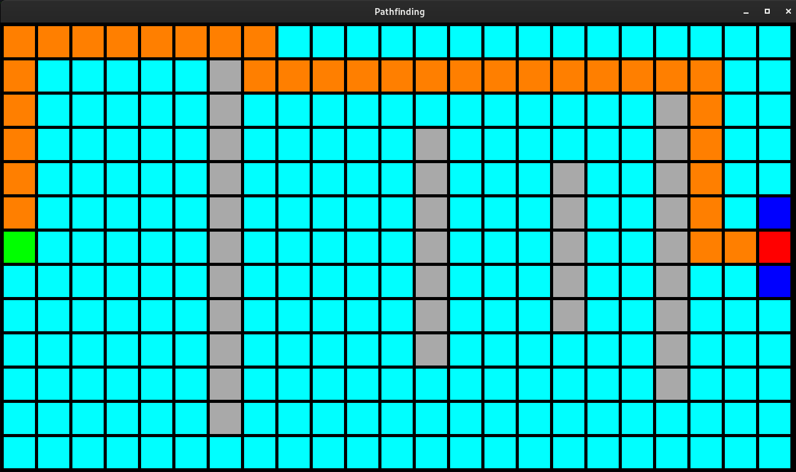

# pathfinding
Visualisation of a few algorithms for finding the shortest path between two vertices in undirected graph, where each edge has same weight.

The graph is represented by a grid, where each rectangle is vertex. Each vertex is connected to its adjacent vertices (not diagonally - will be added).

The shortest path represents the shortest Manhattan distance between two rectangles on the grid.

User can create "walls" - remove some vertices from the graph.

After start, vertices change their colours one by one as they are searched, thus visualisating the advacement of the concrete algorithm.

To use this program, user has to have SFML library installed. (https://www.sfml-dev.org/)

Tested on Fedora 35.

## Compilation
Get the repository and run `make` in terminal.

To clean up run `make clean`.

## Usage
In terminal, run `./pathfinding <algorithm>`, for now only bfs algorithm is working.

Setting start: Press "S" and left-click.

Setting end: Press "E" and left-click.

Setting wall (removing vertex): Left-click.

Reset: Press "R".

Start: Press "Space".

## Examples

